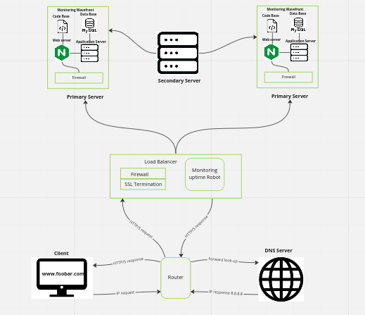

# Secured  and Monitored Web Infrastructure

[Visit Board](https://miro.com/app/board/uXjVPjP05Y4=/)

## Description

A three-server web infrastructure that secures, monitors, and encrypts server traffic.

## About This Infrastructure

### For every additional element, why you are adding it

+ 3 Firewalls: After the first firewall receives the request, it can check the rules and reject further requests. The 2nd firewall runs on the server to prevent hacking according to requests, and the 3rd firewall acts as a chain-level firewall that verifies information transactions.

+ SSL Certificate:  Added to secure https protocol and encrypt communication. This makes protocol communication and data transmission in browsers and web servers more secure as the "plaintext" cannot be easily accessed or viewed by third parties.

### What are firewalls for

A firewall is a network security device that monitors network traffic. It can be understood as a separation or "wall" between private and public networks that restricts and blocks network traffic based on a set of security rules in hardware or software. Analysis of data packets requesting network entry. Firewalls are also used to provide remote access to private networks through secure authentication.

### Why is the traffic served over HTTPS

HTTPS stands for Secure Hypertext Transfer Protocol and provides traffic for security using a secure port 443 that encrypts outgoing information. This makes it harder to peek or access site information.

### What monitoring is used for

Monitoring not only helps to make sure to maintain high quality levels, keeping the established standards and consistency, but also to help in the continuous improvement of the resources performance.

### How the monitoring tool is collecting data

IT monitoring is composed of three parts: 1) Fundation; 2) Software, and 3) Interpretation in order to function.

+ Foundation:  Are related to the infrastructure at its lowest layer of the software stack. This includes physical and virtual devices, such as servers, CPUs and VMs.
+ Software:  The software is the monitoring section which analyzes what is happening in the devices (physical or virtual machines) in terms of CPU usage, load, memory, and running count.
+ Interpretation:  Here is where collected data is turned into metrics and are presented through graphs or data charts (mostly on GUI dashboard). This is often integrated with tools of data visualization to help better understand and do data analytics of performance.

### Explain what to do if you want to monitor your web server QPS

Requests per second is a measure of the rate at which traffic reaches a particular server serving a web domain. This is an important metric to monitor, as it helps you decide whether to scale your server to handle usage and resource requirements to avoid crashing web pages in the future due to an overload of requests to the server.

## Issues With This Infrastructure

+ Terminating SSL at the load balancer level would leave the traffic between the load balancer and the web servers unencrypted.
+ Having one MySQL server is an issue because it is not scalable and can act as a single point of failure for the web infrastructure.
+ Having servers with all the same components would make the components contend for resources on the server like CPU, Memory, I/O, etc., which can lead to poor performance and also make it difficult to locate the source of the problem. A setup such as this is not easily scalable. 